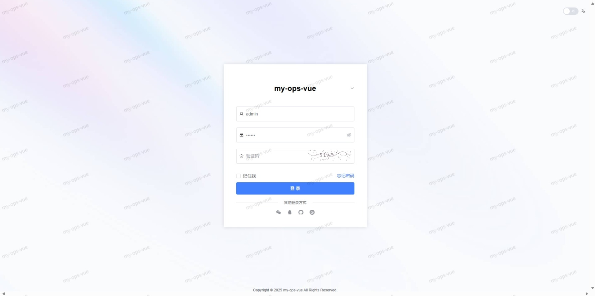
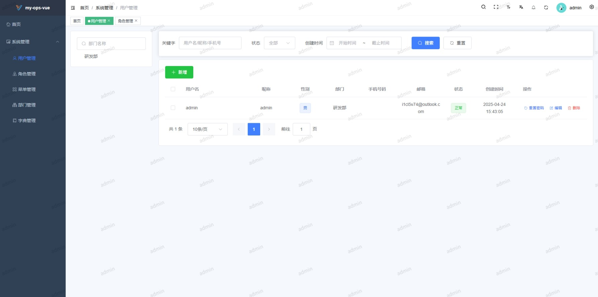
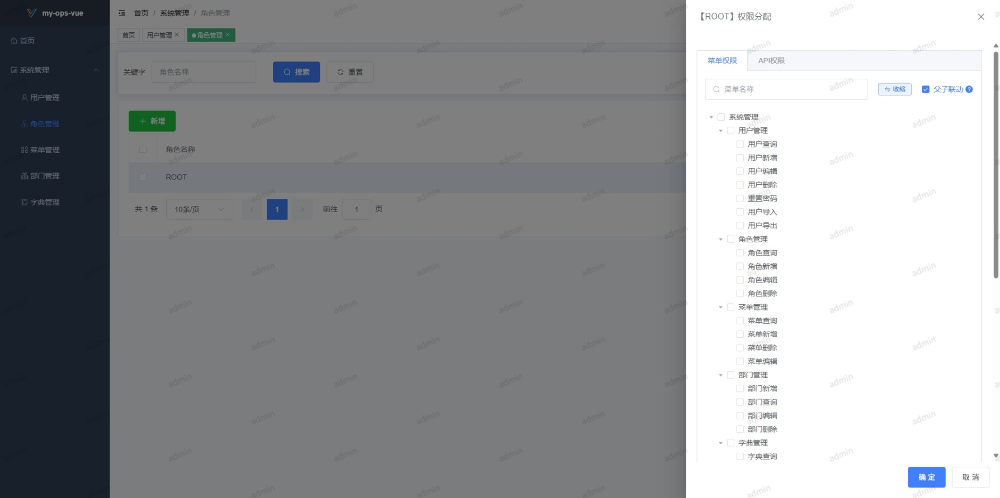
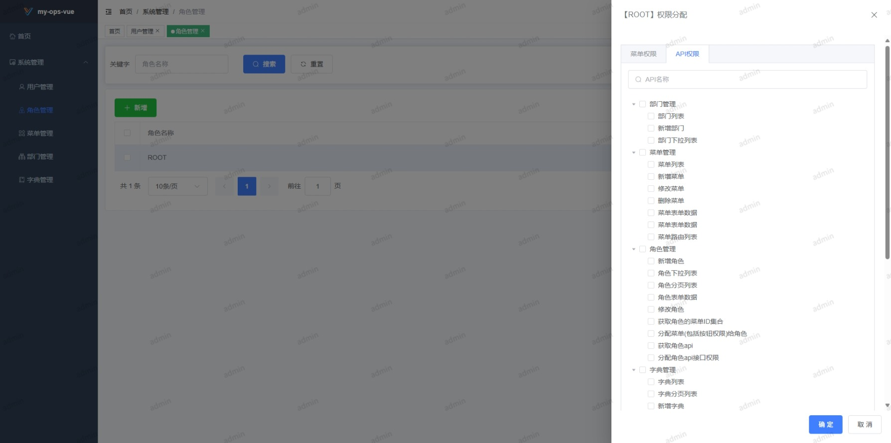
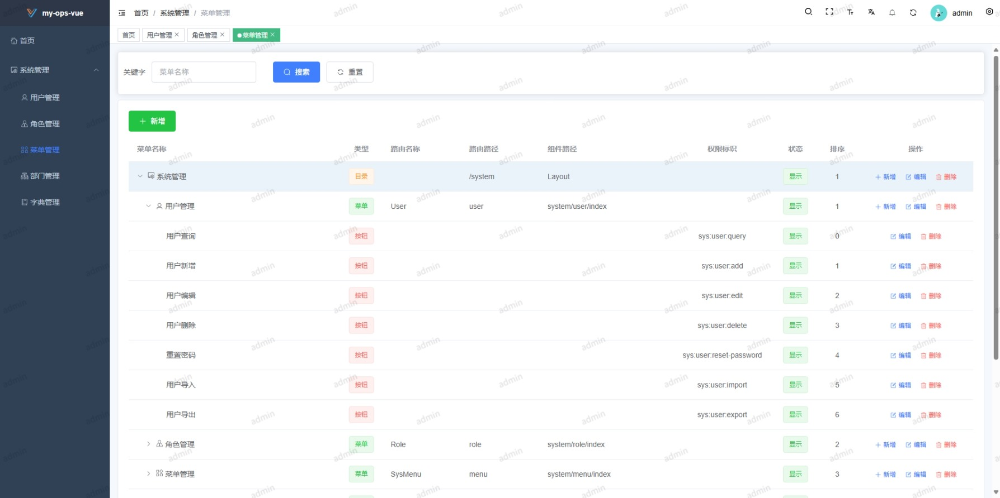

# 项目介绍

使用golang实现基于 GIN + GORM + Casbin 的后台框架。

当时想使用[vue3-element-admin-js](https://gitee.com/youlaiorg/vue3-element-admin-js)前端模板，但是没找到go后端，故自己参考接口文档实现go[后端](./server)。

在开发中由于URI冲突问题，对字典项路由地址进行了修改。并对[前端](./web)进行了一定修改，增加了API权限分配功能。

后端目前仅支持PostgreSQL数据库。

# 页面展示

